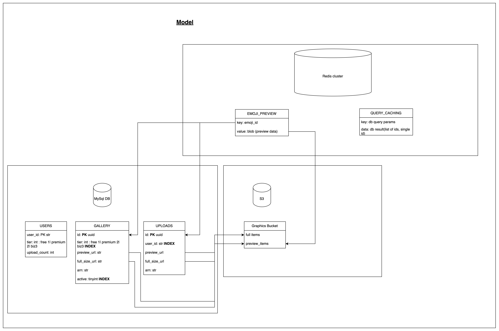
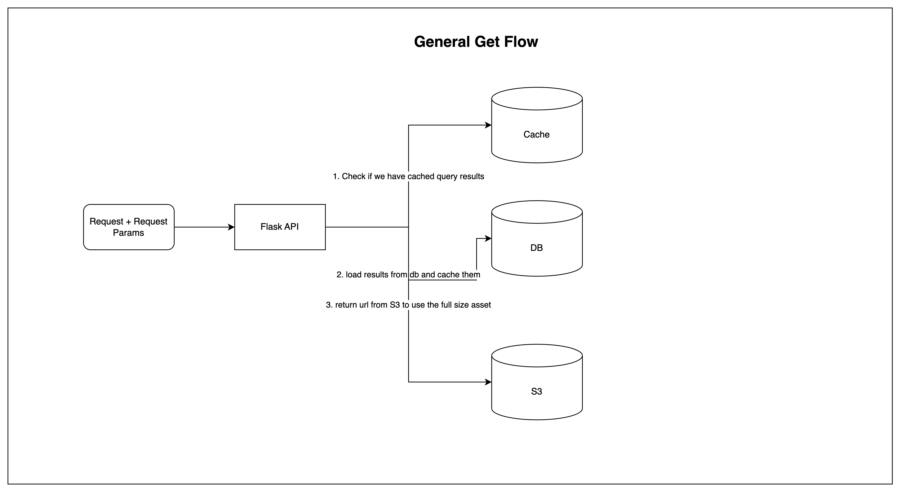
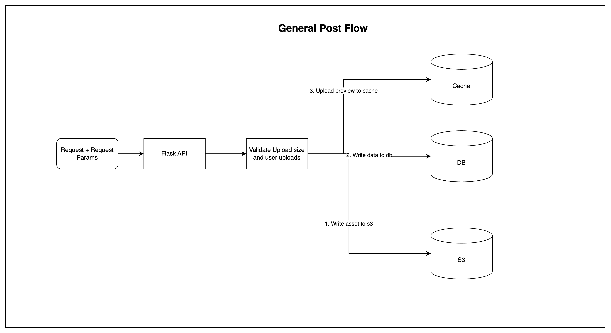
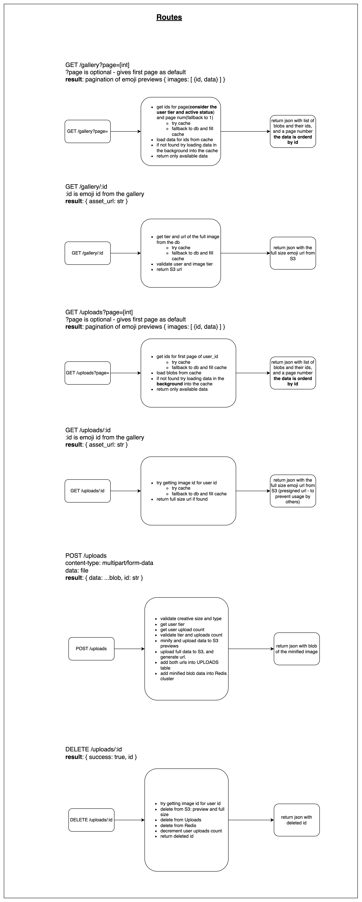

# Emoji API home task

## How to run it?
1. you need to have `poetry` installed on you machine - run `pip install poetry`
2. after that run `poetry install` to install all dependencies
3. go into the virtual env - run `poetry shell`
4. final step - run `python3 src/main.py`

## How to test the routes?

* get images form gallery: `curl  http://127.0.0.1:5000/api/gallery?page=1`
* get full size image url form gallery: `curl  http://127.0.0.1:5000/api/gallery/123`
* get images form user uploads: `curl  http://127.0.0.1:5000/api/uploads?page=1`
* get full size image url form user uploads: `curl  http://127.0.0.1:5000/api/uploads/123`
* upload image: `curl -X POST -F "data=@.../<path_to_your_file>" http://localhost:5000/api/uploads`

## Howe does it works?
All images are stored in s3 - their full version and their minified version
All minified versions are also stored as blob on a Redis cluster for fast access
All image data like url, arn, id, user_id(in case private image) are stored in the db
All interactions are validated on the user tier(free, premium, business) and on the emoji access tier

### GET multiple images
This case is for displaying preview of images in the tab
All the previews are cached in redis cluster so the IO is minimal instead of loading them from s3
All queries are stored in cache also and expire after a given time (set to 5000ms at the moment)

The get request retrieves a paginated result of 20 images every time:
1. get query request from cache
    * if the query exists in cache - take the image ids and load their previews from cache
    * if the query doesn't exists in cache - load the data from db and cache the result with the expiry ttl
2. get the ids from the query and load their previews from cache

### GET for single image
This case is when you decided which emoji you want to use in your video
Queries are stored in cache
We return a url to the full size asset

1. try load the query from cache
    * if exists in cache return the url
    * if not exists in cache - take it from db and cache the result
    * in case it is private - take generate a presigned url and return that (not implemented)
2. return the url to the asset

### POST for a single image
This case used when a user wants to upload an image to private usage

1. the size of the emoji is validate - max size is 10mb
2. the user count of uploaded images is also validated
3. the image is minified
4. an image uuid generated
5. the minified and the full versions are uploaded to s3
6. the data about the image is stored in db
7. the minified version is stored in cache

### How it scales?
The service is open to the world behind AWS API Gateway which scales automatically and supports high loads
The service is stateless so it can be deployed in a container and scaled to handle peak times
The Redis cluster scales and prevent high request count to the DB or to the s3

## API Routes

